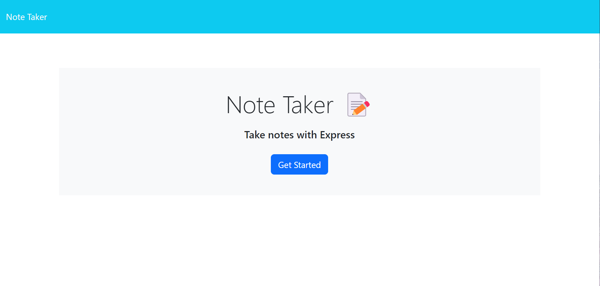
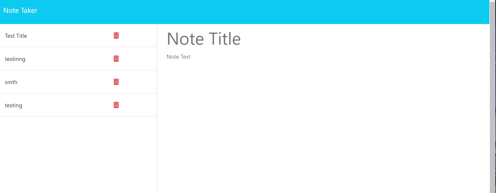

# Note-taker

 
  

## Description
📙 Simple Application that allows user to save their task/make their to-do list

## Table of Contents
- [Description](#description)
- [Installation](#installation)
- [Usage](#usage)
- [License](#license)
- [Contributing](#contributing)
- [Tests](#tests)

## Installation

⚙️ Clone Repo

⚙️ Npm I

⚙️ Then run the app with node server

OR visit Deployed URL: 

## Usage

💻 When user visits the webpage they are presented with home page, once user clicks Get started they are presented with the page where they can take notes. On the right side they can write Note title and descreption below, click save and they will see saved note on the left side. 

## Mock-up

## License

 

This application is covered by the MIT license. 

## Contributing

Used mini project as reference

## Tests
📝 No

Find me on GitHub: [Misachka](https://github.com/Misachka)
